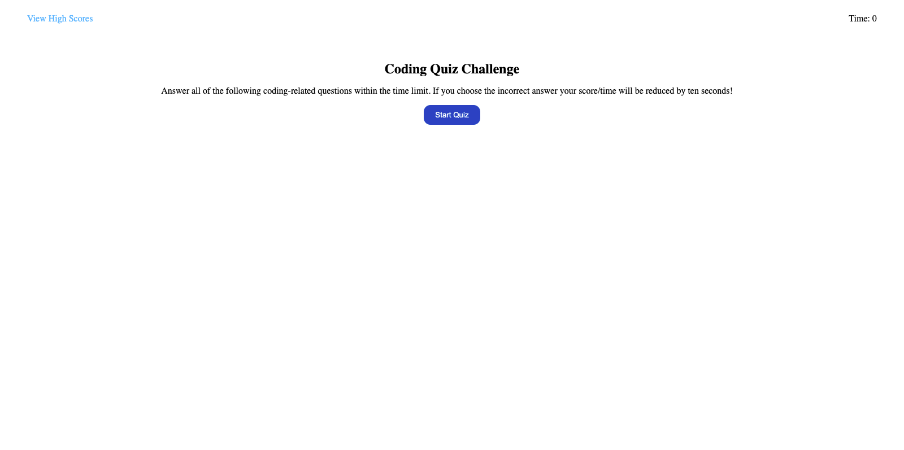
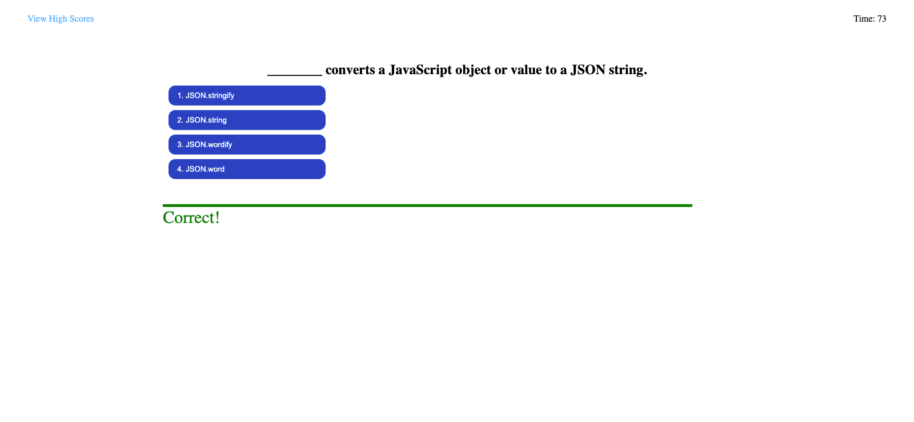
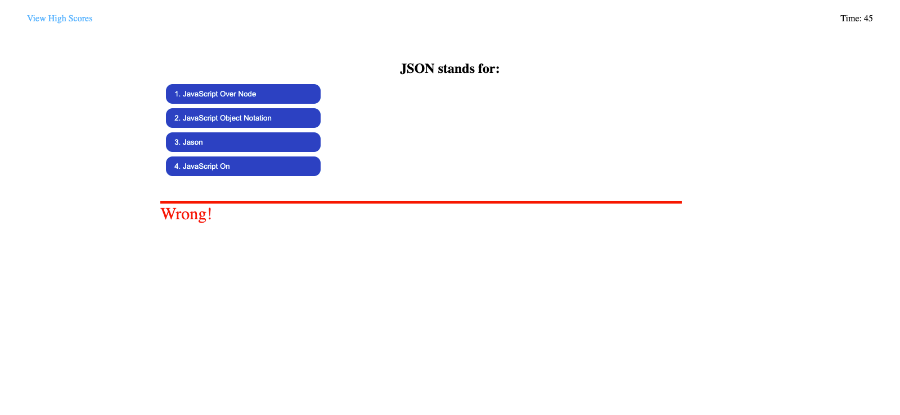
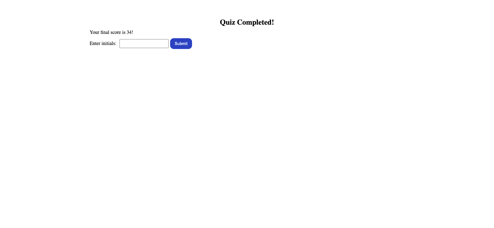
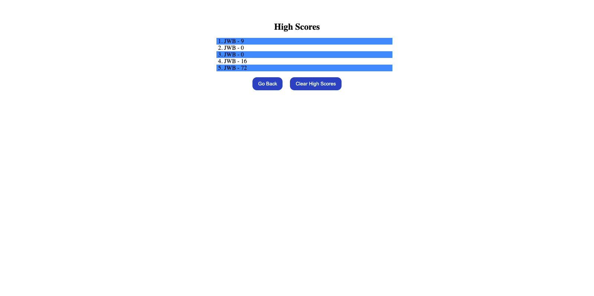

# Code Quiz

## Purpose
An online quiz to test users' knowledge of JavaScript. Users need to answer questions both quickly and accurately. If users answer incorrectly then ten seconds will be deducted from the time. The users' scores will be the amount of time remaining when they finish the quiz. The faster they can accurately answer questions, the higher their score will be. High scores are saved in localStorage.

## Built With
* HTML
* CSS
* JavaScript

## Website
https://jbeedle19.github.io/code-quiz/

## Screenshots

## Contribution
Made with ❤️ by Joshua Beedle